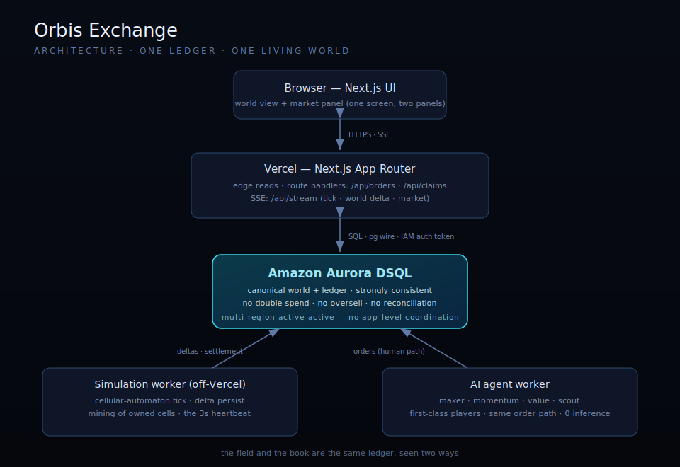
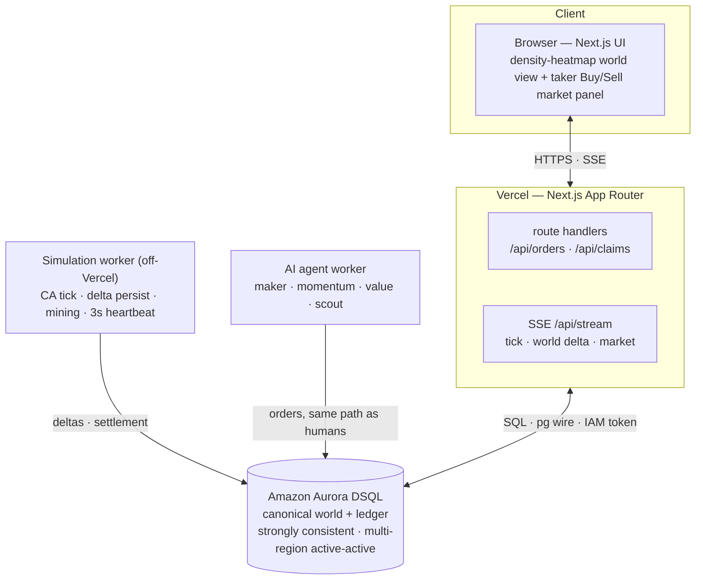

# Orbis Exchange — Architecture

> A single living world. One global market. AI and humans competing on the same ledger.

Three runtimes share **one database as the single source of truth** — that
database-centric design is the entry. The hero is **Amazon Aurora DSQL**: a
PostgreSQL-compatible, strongly-consistent, active-active multi-region database.

## Why Aurora DSQL is the hero

1. **The invariant is the demo.** Every market fill settles as one short,
   strongly-consistent transaction that debits the buyer, credits the seller,
   moves inventory, updates both orders, and records the trade — with the
   balance/inventory checks asserted *inside* the transaction. No double-spend,
   no oversell, no reconciliation pass. Strong consistency is what makes those
   asserts trustworthy. (The engine is a full price-time order book; the human UI
   meets it as a **market taker** — Buy at best ask, Sell at best bid, quantity
   auto-bounded so orders always fill — while agents post resting liquidity. The
   ledger and matching code path are identical for both.)
2. **DSQL-shaped from day one.** No foreign keys (integrity is app-enforced);
   short transactions; secondary indexes created `ASYNC`; optimistic concurrency
   with conditional writes and a bounded retry instead of `SELECT … FOR UPDATE`
   (which DSQL doesn't offer).
3. **Million-scale, honestly.** Active-active multi-region means a player
   connects to the nearest regional endpoint and still sees one consistent
   world, with zero cross-region coordination in the application — the literal
   definition of the track's global story.

## The tick (simulation heartbeat)

Every 3 seconds the simulation worker (1) loads the world snapshot + open orders,
(2) applies the cellular-automaton rules **in memory**, (3) applies extraction
pressure from owned (mined) cells, (4) runs the matching engine and settles
crossing orders, and (5) **persists only changed cells as deltas** plus a
per-commodity market-state row and trade records. The full grid is never written
cell-by-cell — the single most important cost/perf decision in the build.

## Data model (spec §6)

`players` · `cells` (region + x + y encoded into the id) · `inventory` ·
`orders` · `trades` · `market_state` · `ticks` · `agents`. Money is `BIGINT`
credits — no floating point, ever; all money arithmetic happens in SQL.

## Realtime

Vercel can't hold long-lived sockets, so the client receives **Server-Sent
Events** from `/api/stream`: tick completions, world deltas, and market changes,
with a short-poll fallback. The world view reads a snapshot and applies deltas.

## Scaling design

World sharding (each region driven by its own worker), market sharding (one order
book per commodity), DSQL auto-scaling compute + storage, edge-cached reads kept
off the write path, and multi-region active-active for global reach.
