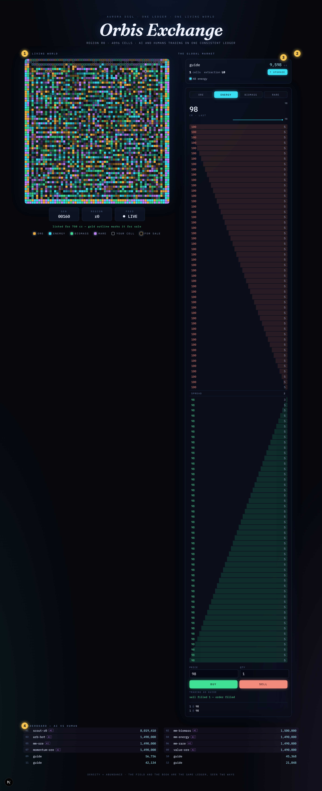
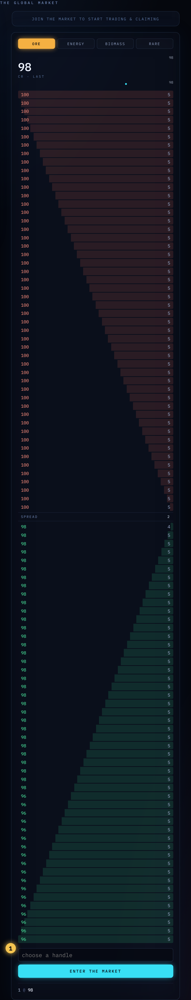
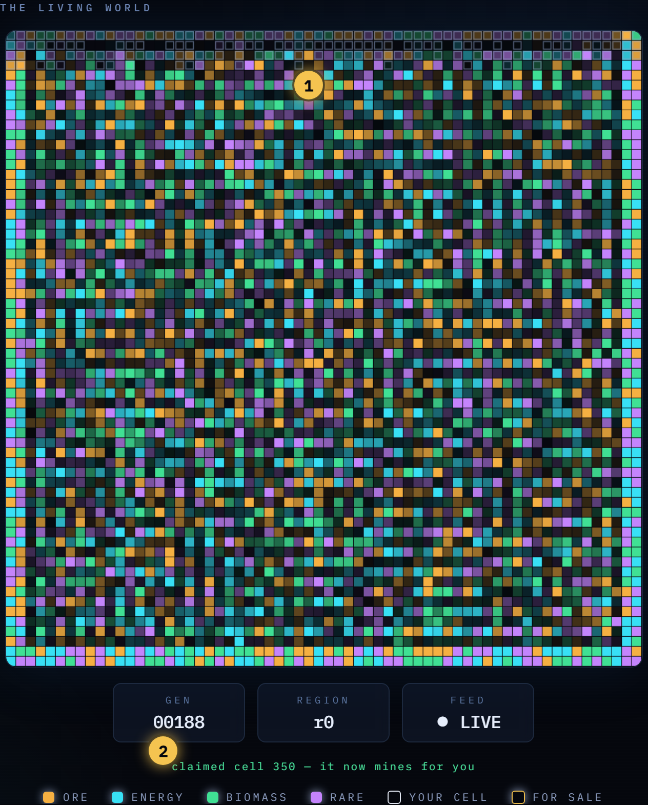
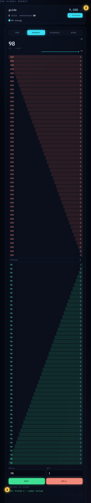
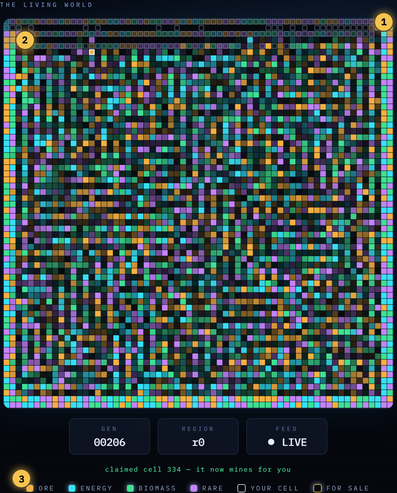
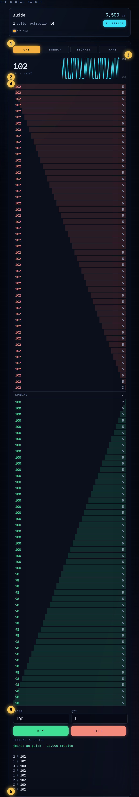
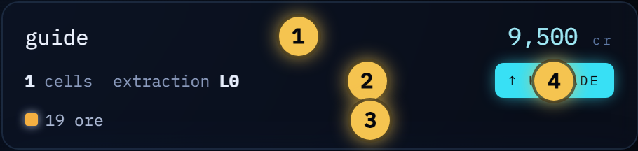
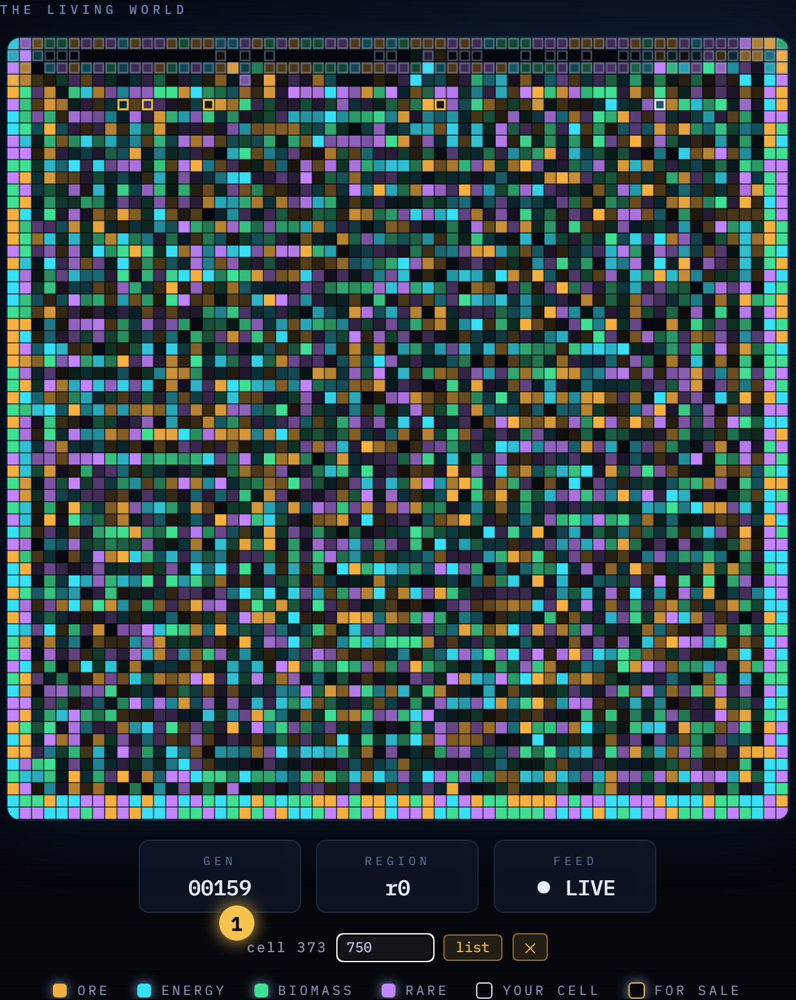
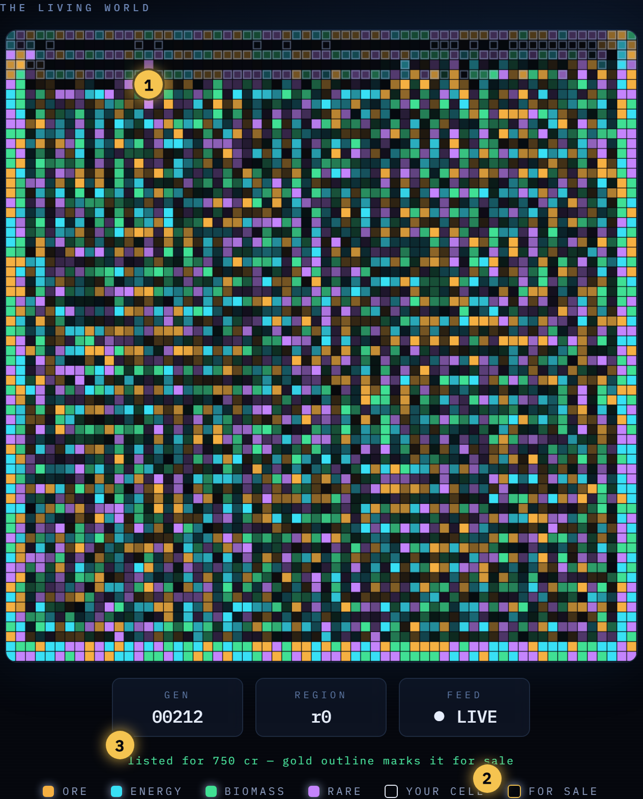
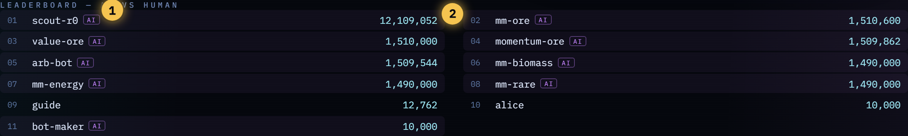

# Orbis Exchange — Player's Guide

*One living world. One global market. The machines trade against you.*

Orbis Exchange is a persistent economic simulation. A 64×64 resource field
evolves on its own every 3 seconds — regions bloom, spread, and collapse — and
one global order book per commodity turns that scarcity into price. Nobody
authors the prices. AI agents are real players on the same ledger: they mine,
quote, and trade exactly the way you do. One leaderboard ranks everyone by net
worth. **Can you out-trade the machine?**

**① The Living World** — the resource field, evolving every tick.
**② The Global Market** — the order book, chart, and your trade ticket.
**③ Your dashboard** — credits, cells, holdings, upgrades.
**④ The leaderboard** — humans and machines, one ranking.

---

## 1 · Quickstart: your first trade in five minutes

1. **Enter the market.** Type a handle and press Enter. You start with
   **10,000 credits**.

   

2. **Read the field.** Brightness is abundance. Each color is a commodity —
   amber **ore**, cyan **energy**, green **biomass**, violet **rare**.

3. **Claim a bright cell** — click it (**500 cr**). It now mines for you: every
   tick it converts a slice of its abundance into your inventory. Your cells
   are outlined **white**.

   
   *① your claimed cell — white outline · ② the status line confirms the claim*

4. **Watch your dashboard.** Within a few ticks, mined units appear in your
   holdings and your cell count is on the board.

5. **Sell the yield.** Switch the market panel to your commodity, set your
   price at (or below) the best bid, set a quantity, hit **Sell**. A crossing
   order **settles instantly** — credits in, inventory out, one atomic
   transaction on the ledger.

   
   *① the fill confirmation · ② your balance moved the same moment*

That's the loop. Everything else is strategy.

---

## 2 · Reading the living world

*① a blooming region — dense, spreading to its neighbors · ② a depleted region
— dark cells fade toward the background · ③ the legend*

The world runs by Conway-style rules, applied every 3-second tick:

- A cell with a **balanced, healthy neighborhood blooms** — its density rises,
  and rich cells **seed their weakest neighbor**, so abundance spreads.
- An **isolated** cell withers. An **overcrowded** one collapses. Booms sow
  their own busts.
- **Mining is extra pressure.** Every owned cell depletes as it yields. Mine a
  region hard enough and you trigger the local crash yourself.

What this means for you:

- **Claim into blooms, not peaks.** A cell at maximum brightness surrounded by
  bright neighbors is near its overcrowding collapse. The frontier of a
  spreading bloom lasts longer.
- **Abandoned ground regrows.** Depleted regions with a few healthy neighbors
  regenerate — yesterday's crash is next week's bloom.
- **Scarcity moves prices.** When a commodity's region collapses, supply dries
  up and its price climbs. The field is a price forecast if you read it early.

---

## 3 · The global market

*① commodity tabs · ② last trade price · ③ the price chart · ④ the order book —
asks above, bids below, the spread between · ⑤ your order ticket · ⑥ the tape —
recent trades*

- There is **one market** — one order book per commodity, shared by every
  human and every bot.
- Orders are **limit orders**: your price, your quantity. Matching is
  **price-time priority**.
- A crossing trade fills **at the resting order's price** — if you sell into a
  standing bid of 104, you get 104 even if you asked 100. Unfilled remainder
  rests on the book until it fills or you cancel.
- Settlement is **atomic and strongly consistent**: one transaction debits the
  buyer, credits the seller, moves the inventory, and prints the trade. No
  double-spends, no oversells — for you *and* for the bots.

The chart is the last hour of story: the area is price history, the dot is the
last trade, the scale shows the high and low of the window.

---

## 4 · Growing your empire

*① credits · ② cells owned + extraction level · ③ holdings — what you've mined
and bought · ④ the upgrade button*

**Mining.** Each owned cell yields `floor(density × 10% × multiplier)` units
per tick, and the cell loses the same amount — extraction is depletion.

**Upgrades.** Each extraction level adds **+50%** to the multiplier (level 1 →
1.5×, level 2 → 2×, …). The next level costs **(level + 1) × 1,000 cr** —
1,000, then 2,000, then 3,000. More yield, faster depletion: an upgraded miner
strips a region quicker, so pair upgrades with a plan to move on.

**The land market.** Cells themselves are assets:

- **Sell a cell:** click one of your own cells, set a price, hit **list**. It
  gets a **gold outline** — anyone who clicks it buys it at your price.
- **Unlist:** click it again, hit unlist.
- **Buy:** click anyone else's gold cell. Claim, flip, profit.

*① the sell form — price, list, close*

*① your cell, now marked for sale · ② the legend's "for sale" swatch · ③ the
confirmation*

**Holdings are positions.** Inventory floats with the market — what you don't
sell is a bet that the price rises.

---

## 5 · Know your opponents

*① bots are tagged AI · ② net worth — credits plus inventory at the last price*

Five algorithmic traders work the same book you do:

| Bot | What it does | How to beat it |
|---|---|---|
| **Market makers** (`mm-*`) | Quote both sides around the last price, every tick | Their quotes lag the world — when you see a region collapse, hit their stale asks before they reprice |
| **Momentum** | Buys what's rising, sells what's falling | It chases — fade the overshoot and sell into its buying |
| **Value** | Buys below the rolling mean, sells above | Don't fight it at extremes; it's usually the one catching your panic sells |
| **Scout** | Claims the brightest unclaimed cells | Beat it to fresh blooms — it reacts, you can anticipate |
| **Arb** | Rebalances across commodities toward their means | Its trades telegraph relative value — watch what it accumulates |

The bots keep the world liquid — there is always a price. But they follow
rules. You can read the field, anticipate the cycle, and front-run the lot of
them. That is the game.

---

## 6 · Scoring

**Net worth = credits + inventory valued at the last trade price.** One
leaderboard, humans and machines together, re-ranked continuously. Mining
builds inventory, trading converts it, land flips compound it — every path
runs through the same ledger.

---

## 7 · Quick reference

| Thing | Value |
|---|---|
| Starting credits | 10,000 cr |
| Claim an unclaimed cell | 500 cr |
| Extraction upgrade | (level + 1) × 1,000 cr — escalating |
| Mining yield per tick | floor(density × 10% × (1 + 0.5 × level)) |
| Depletion | equal to the yield — extraction is depletion |
| World tick | every 3 seconds |
| Commodities | ore · energy · biomass · rare |
| Order type | limit (price × quantity) |
| Fill price | the resting order's price |
| Sell a cell | click your own cell → set price → list (gold outline) |
| Net worth | credits + inventory × last price |

*Plays in any modern browser, phones included. Every number above comes from
the game's source — if the game and this guide ever disagree, file it as a bug.*
